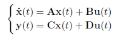
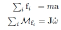
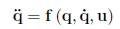
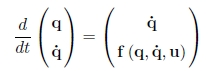
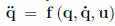
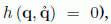

# 1. Modeling

We will call modeling the step that consists of finding a more or less accurate state representation of the system we are looking at. In general, constant parameters appear in the state equations (such as the mass or the inertial moment of a body, the coefficient of viscous friction, the capacitance of a capacitor, etc.). In these cases, an identification step may prove to be necessary. In this book, we will assume that all the parameters are known, otherwise we invite the reader to consult Eric Walter’s book [WAL 14] for a broad range of identification methods. Of course, no systematic methodology exists that can be used to model a system. The goal of this chapter and of the following exercises is to present, using several varied examples, how to obtain a state representation.

## 1.1. 선형 시스템

연속 시간의 경우, 선형시스템은 다음과 같은 상태 방정식으로 설명할 수 있다.

선형시스템은 자연에서는 대체로 드물다. 하지만 또는 운영 지점 부분의 비선형 시스템을 선형대수 기법이나 허용가능한 방식의 근사치로 비교적 쉽게 다룬다. 

Linear systems are rather rare in nature. However, they are relatively easy to manipulate using linear algebra techniques and often approximate in an acceptable manner the nonlinear systems around their operating point.

## 1.2. 로봇 기계 시스템

The fundamental principle of dynamics allows us to easily find the state equations of mechanical systems (such as robots). The resulting calculations are relatively complicated for complex systems and the use of computer algebra systems may prove to be useful. In order to obtain the state equations of a mechanical system composed of several subsystems S1, S2, . . . , Sm, assumed to be rigid, we follow three steps:

1) 미분방정식 얻기. 

For each subsystem Sk, with mass m and inertial matrix J, the following relations must be applied:

where the fi are the forces acting on the subsystem Sk, Mfi represents the torque created by the force fi on Sk, with respect to its center. The vector a represents the tangential acceleration of Sk and the vector images/ch1_image_2_4a.gif represents the angular acceleration of Sk. After decomposing these 2m vectorial equations according to their components, we obtain 6m scalar differential equations such that some of them might be degenerate.

2) 내부 힘 성분들을 제거. 

In differential equations there are the so-called bonding forces, which are internal to the whole mechanical system, even though they are external to each subsystem composing it. They represent the action of a subsystem Sk on another subsystem Sℓ. Following the action–reaction principle, the existence of such a force, denoted by fk,ℓ , implies the existence of another force fℓ,k, representing the action of Sℓ on Sk, such that images/ch1_Inline_3_9.gif Through a formal manipulation of the differential equations and by taking into account the equations due to the action-reaction principle, it is possible to remove the internal forces. The resulting number of differential equations has to be reduced to the number n of degrees of freedom q1, . . . , qn of the system.

3) 상태 방정식 얻기. 

We then have to isolate the second derivative images/ch1_Inline_3_6.gif from the set of n differential equations in such a manner to obtain a vectorial relation such as:

where u is the vector of external forces that are not derived from a potential (in other words, those which we apply to the system). The state equations are then written as:

A mechanical system whose dynamics can be described by the relation  will be referred to as holonomic. For a holonomic system, q and  are thus independent. If there is a so-called non-holonomic constraint that links the two of them (of the form  the system will be referred to as non-holonomic. Such systems may be found for instance in mobile robots with wheels [LAU 01]. Readers interested in more details on the modeling of mechanical systems may consult [KHA 07].

## 1.3. 서보모터

A mechanical system is controlled by forces or torques and obeys a dynamic model that depends on many poorly known coefficients. This same mechanical system represented by a kinematic model is controlled by positions, velocities or accelerations. The kinematic model depends on well-known geometric coefficients and is a lot easier to put into equations. In practice, we move from a dynamic model to its kinematic equivalent by adding servomotors. In summary, a servomotor is a direct current motor with an electrical control circuit and a sensor (of the position, velocity or acceleration). The control circuit computes the voltage u to give to the motor in order for the value measured by the sensor corresponds to the setpoint w. In practice, the signal w is generally given in the form of a square wave called pulse-width modulation (PWM) ). There are three types of servomotors:

