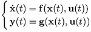
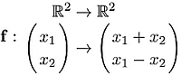

# 2. Simulation

In this chapter, we will show how to perform a computer simulation of a nonlinear system described by its state equations:

This step is important in order to test the behavior of a system (controlled or not). Before presenting the simulation method, we will introduce the concept of vector fields. This concept will allow us to better understand the simulation method as well as certain behaviors that could appear in nonlinear systems. We will also give several concepts of graphics that are necessary for the graphical representation of our systems.

## 2.1. 벡터 필드의 개념

We will now present the concept of vector fields and show the manner in which they are useful in order to better understand the various behaviors of systems. We invite the readers to consult Khalil [KHA 02] for further details on this subject. A vector field is a continuous function f of Rn to Rn. When n = 2, a graphical representation of the function f can be imagined. For instance, the vector field associated with the linear function:

is illustrated in Figure 2.1. In order to obtain this figure, we have taken a set of vectors from the initial set, following a grid. Then, for each grid vector x, we have drawn its image vector f (x) by giving it the vector x as origin.

Figure 2.1. 선형 애플리케이션과 연관된 벡터 필드

