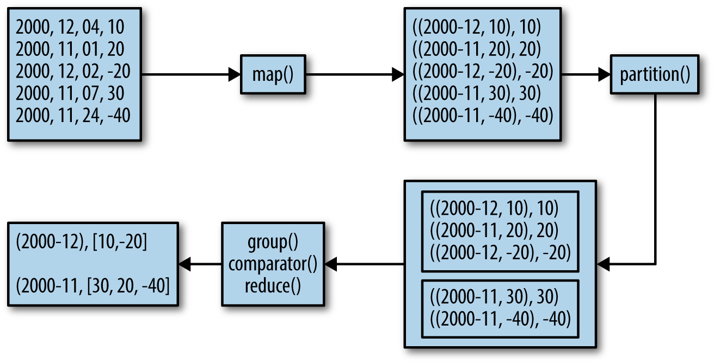

# Chapter 1. Secondary Sort: Introduction

A secondary sort problem relates to sorting values associated with a key in the reduce phase. Sometimes, it is called value-to-key conversion. The secondary sorting technique will enable us to sort the values (in ascending or descending order) passed to each reducer. I will provide concrete examples of how to achieve secondary sorting in ascending or descending order.

The goal of this chapter is to implement the Secondary Sort design pattern in MapReduce/Hadoop and Spark. In software design and programming, a design pattern is a reusable algorithm that is used to solve a commonly occurring problem. Typically, a design pattern is not presented in a specific programming language but instead can be implemented by many programming languages.

The MapReduce framework automatically sorts the keys generated by mappers. This means that, before starting reducers, all intermediate key-value pairs generated by mappers must be sorted by key (and not by value). Values passed to each reducer are not sorted at all; they can be in any order. What if you also want to sort a reducer’s values? MapReduce/Hadoop and Spark do not sort values for a reducer. So, for those applications (such as time series data) in which you want to sort your reducer data, the Secondary Sort design pattern enables you to do so.

First we’ll focus on the MapReduce/Hadoop solution. Let’s look at the MapReduce paradigm and then unpack the concept of the secondary sort:

```
 map(key1, value1) → list(key2, value2)
 reduce(key2, list(value2)) → list(key3, value3)
```

First, the map() function receives a key-value pair input, (key1, value1). Then it outputs any number of key-value pairs, (key2, value2). Next, the reduce() function receives as input another key-value pair, (key2, list(value2)), and outputs any number of (key3, value3) pairs.

Now consider the following key-value pair, (key2, list(value2)), as an input for a reducer:
```
list(value2) = (V1, V2, ..., Vn)
```

where there is no ordering between reducer values (V1, V2, ..., Vn).

The goal of the Secondary Sort pattern is to give some ordering to the values received by a reducer. So, once we apply the pattern to our MapReduce paradigm, then we will have:
```
SORT(V1, V2, ..., Vn) = (S1, S2, ..., Sn)
list(value2) = (S1, S2, ..., Sn)
```

where:
```
S1 < S2 < ... < Sn (ascending order), or
S1 > S2 > ... > Sn (descending order)
```

Here is an example of a secondary sorting problem: consider the temperature data from a scientific experiment. A dump of the temperature data might look something like the following (columns are year, month, day, and daily temperature, respectively):

```
2012, 01, 01, 5
2012, 01, 02, 45
2012, 01, 03, 35
2012, 01, 04, 10
...
2001, 11, 01, 46
2001, 11, 02, 47
2001, 11, 03, 48
2001, 11, 04, 40
...
2005, 08, 20, 50
2005, 08, 21, 52
2005, 08, 22, 38
2005, 08, 23, 70
```

Suppose we want to output the temperature for every year-month with the values sorted in ascending order. Essentially, we want the reducer values iterator to be sorted. Therefore, we want to generate something like this output (the first column is year-month and the second column is the sorted temperatures):
```
2012-01:  5, 10, 35, 45, ...
2001-11: 40, 46, 47, 48, ...
2005-08: 38, 50, 52, 70, ...
```

## Solutions to the Secondary Sort Problem

There are at least two possible approaches for sorting the reducer values. These solutions may be applied to both the MapReduce/Hadoop and Spark frameworks:

- The first approach involves having the reducer read and buffer all of the values for a given key (in an array data structure, for example), then doing an in-reducer sort on the values. This approach will not scale: since the reducer will be receiving all values for a given key, this approach might cause the reducer to run out of memory (java.lang.OutOfMemoryError). On the other hand, this approach can work well if the number of values is small enough that it will not cause an out-of-memory error.


- The second approach involves using the MapReduce framework for sorting the reducer values (this does not require in-reducer sorting of values passed to the reducer). This approach consists of “creating a composite key by adding a part of, or the entire value to, the natural key to achieve your sorting objectives.” For the details on this approach, see Java Code Geeks. This option is scalable and will not generate out-of-memory errors. Here, we basically offload the sorting to the MapReduce framework (sorting is a paramount feature of the MapReduce/Hadoop framework).

This is a summary of the second approach:

. Use the Value-to-Key Conversion design pattern: form a composite intermediate key, (K, V1), where V1 is the secondary key. Here, K is called a natural key. To inject a value (i.e., V1) into a reducer key, simply create a composite key (for details, see the DateTemperaturePair class). In our example, V1 is the temperature data.
. Let the MapReduce execution framework do the sorting (rather than sorting in memory, let the framework sort by using the cluster nodes).
. Preserve state across multiple key-value pairs to handle processing; you can achieve this by having proper mapper output partitioners (for example, we partition the mapper’s output by the natural key).


## Implementation Details

To implement the secondary sort feature, we need additional plug-in Java classes. We have to tell the MapReduce/Hadoop framework:

. How to sort reducer keys
. How to partition keys passed to reducers (custom partitioner)
. How to group data that has arrived at each reducer


## Sort order of intermediate keys

To accomplish secondary sorting, we need to take control of the sort order of intermediate keys and the control order in which reducers process keys. First, we inject a value (temperature data) into the composite key, and then we take control of the sort order of intermediate keys. The relationships between the natural key, composite key, and key-value pairs are depicted in Figure 1-1.

image:fig1-1.png[alt=""]


The main question is what value we should add to the natural key to accomplish the secondary sort. The answer is the temperature data field (because we want the reducers’ values to be sorted by temperature). So, we have to indicate how DateTemperaturePair objects should be sorted using the compareTo() method. We need to define a proper data structure for holding our key and value, while also providing the sort order of intermediate keys. In Hadoop, for custom data types (such as DateTemperaturePair) to be persisted, they have to implement the Writable interface; and if we are going to compare custom data types, then they have to implement an additional interface called WritableComparable (see Example 1-1).


Example 1-1. DateTemperaturePair class
```
 1 import org.apache.hadoop.io.Writable;
 2 import org.apache.hadoop.io.WritableComparable;
 3 ...
 4 public class DateTemperaturePair
 5    implements Writable, WritableComparable<DateTemperaturePair> {
 6
 7     private Text yearMonth = new Text();                 // natural key
 8     private Text day = new Text();
 9     private IntWritable temperature = new IntWritable(); // secondary key
10
11     ...
12
13     @Override
14     /**
15      * This comparator controls the sort order of the keys.
16      */
17     public int compareTo(DateTemperaturePair pair) {
18         int compareValue = this.yearMonth.compareTo(pair.getYearMonth());
19         if (compareValue == 0) {
20             compareValue = temperature.compareTo(pair.getTemperature());
21         }
22         //return compareValue;    // sort ascending
23         return -1*compareValue;   // sort descending
24     }
25     ...
26 }

```

## Custom partitioner

In a nutshell, the partitioner decides which mapper’s output goes to which reducer based on the mapper’s output key. For this, we need two plug-in classes: a custom partitioner to control which reducer processes which keys, and a custom Comparator to sort reducer values. The custom partitioner ensures that all data with the same key (the natural key, not including the composite key with the temperature value) is sent to the same reducer. The custom Comparator does sorting so that the natural key (year-month) groups the data once it arrives at the reducer.


Example 1-2. DateTemperaturePartitioner class
```
 1 import org.apache.hadoop.io.Text;
 2 import org.apache.hadoop.mapreduce.Partitioner;
 3
 4 public class DateTemperaturePartitioner
 5    extends Partitioner<DateTemperaturePair, Text> {
 6
 7     @Override
 8     public int getPartition(DateTemperaturePair pair,
 9                             Text text,
10                             int numberOfPartitions) {
11         // make sure that partitions are non-negative
12         return Math.abs(pair.getYearMonth().hashCode() % numberOfPartitions);
13      }
14 }
```
Hadoop provides a plug-in architecture for injecting the custom partitioner code into the framework. This is how we do so inside the driver class (which submits the MapReduce job to Hadoop):
```
import org.apache.hadoop.mapreduce.Job;
...
Job job = ...;
...
job.setPartitionerClass(TemperaturePartitioner.class);
```


## Grouping comparator

In Example 1-3, we define the comparator (DateTemperatureGroupingComparator class) that controls which keys are grouped together for a single call to the Reducer.reduce() function.


Example 1-3. DateTemperatureGroupingComparator class
```
 1 import org.apache.hadoop.io.WritableComparable;
 2 import org.apache.hadoop.io.WritableComparator;
 3
 4 public class DateTemperatureGroupingComparator
 5    extends WritableComparator {
 6
 7     public DateTemperatureGroupingComparator() {
 8         super(DateTemperaturePair.class, true);
 9     }
10
11     @Override
12     /**
13      * This comparator controls which keys are grouped
14      * together into a single call to the reduce() method
15      */
16     public int compare(WritableComparable wc1, WritableComparable wc2) {
17         DateTemperaturePair pair = (DateTemperaturePair) wc1;
18         DateTemperaturePair pair2 = (DateTemperaturePair) wc2;
19         return pair.getYearMonth().compareTo(pair2.getYearMonth());
20     }
21 }
```
Hadoop provides a plug-in architecture for injecting the grouping comparator code into the framework. This is how we do so inside the driver class (which submits the MapReduce job to Hadoop):
```
job.setGroupingComparatorClass(YearMonthGroupingComparator.class);
```


## Data Flow Using Plug-in Classes

To help you understand the map() and reduce() functions and custom plug-in classes, Figure 1-2 illustrates the data flow for a portion of input.


Secondary Sorting Data Flow 
Figure 1-2. Secondary sorting data flow

The mappers create (K,V) pairs, where K is a composite key of (year,month,temperature) and V is temperature. The (year,month) part of the composite key is the natural key. The partitioner plug-in class enables us to send all natural keys to the same reducer and the grouping comparator plug-in class enables temperatures to arrive sorted at reducers. The Secondary Sort design pattern uses MapReduce’s framework for sorting the reducers’ values rather than collecting them all and then sorting them in memory. The Secondary Sort design pattern enables us to “scale out” no matter how many reducer values we want to sort.

## MapReduce/Hadoop Solution to Secondary Sort

This section provides a complete MapReduce implementation of the secondary sort problem using the Hadoop framework.


### Input

The input will be a set of files, where each record (line) will have the following format:
```
Format:
        <year><,><month><,><day><,><temperature>

Example:
        2012, 01, 01, 35
        2011, 12, 23, -4
```


### Expected Output

The expected output will have the following format:
```
Format:
        <year><-><month>: <temperature1><,><temperature2><,> ...
        where temperature1 <= temperature2 <= ...

Example:
        2012-01:  5, 10, 35, 45, ...
        2001-11: 40, 46, 47, 48, ...
        2005-08: 38, 50, 52, 70, ...
```


### map() Function

The map() function parses and tokenizes the input and then injects the value (temperature) into the reducer key, as shown in Example 1-4.


Example 1-4. map() for secondary sorting
```
 1 /**
 2  * @param key is generated by Hadoop (ignored here)
 3  * @param value has this format: "YYYY,MM,DD,temperature"
 4  */
 5 map(key, value) {
 6    String[] tokens = value.split(",");
 7    // YYYY = tokens[0]
 8    // MM = tokens[1]
 9    // DD = tokens[2]
10    // temperature = tokens[3]
11    String yearMonth = tokens[0] + tokens[1];
12    String day = tokens[2];
13    int temperature = Integer.parseInt(tokens[3]);
14    // prepare reducer key
15    DateTemperaturePair reducerKey = new DateTemperaturePair();
16    reducerKey.setYearMonth(yearMonth);
17    reducerKey.setDay(day);
18    reducerKey.setTemperature(temperature); // inject value into key
19    // send it to reducer
20    emit(reducerKey, temperature);
21 }
```


### reduce() Function

The reducer’s primary function is to concatenate the values (which are already sorted through the Secondary Sort design pattern) and emit them as output. The reduce() function is given in Example 1-5.


Example 1-5. reduce() for secondary sorting
```
 1 /**
 2  * @param key is a DateTemperaturePair object
 3  * @param value is a list of temperatures
 4  */
 5 reduce(key, value) {
 6    StringBuilder sortedTemperatureList = new StringBuilder();
 7    for (Integer temperature : value) {
 8       sortedTemperatureList.append(temperature);
 9       sortedTemperatureList.append(",");
10    }
11    emit(key, sortedTemperatureList);
12 }
```


### Hadoop Implementation Classes

The classes shown in Table 1-1 are used to solve the problem.

Table 1-1. Classes used in MapReduce/Hadoop solution

[cols="4,6"]
|==================
|*Class name*| *Class description*
|SecondarySortDriver |The driver class; defines input/output and registers plug-in classes 
|SecondarySortMapper |Defines the map() function 
|SecondarySortReducer |Defines the reduce() function 
|DateTemperatureGroupingComparator |Defines how keys will be grouped together 
|DateTemperaturePair |Defines paired date and temperature as a Java object 
|DateTemperaturePartitioner |Defines custom partitioner 
|==================

How is the value injected into the key? The first comparator (the DateTemperaturePair.compareTo() method) controls the sort order of the keys, while the second comparator (the DateTemperatureGroupingComparator.compare() method) controls which keys are grouped together into a single call to the reduce() method. The combination of these two comparators allows you to set up jobs that act like you’ve defined an order for the values.

The SecondarySortDriver is the driver class, which registers the custom plug-in classes (DateTemperaturePartitioner and DateTemperatureGroupingComparator) with the MapReduce/Hadoop framework. This driver class is presented in Example 1-6.


Example 1-6. SecondarySortDriver class
```
 1 public class SecondarySortDriver extends Configured implements Tool {
 2     public int run(String[] args) throws Exception {
 3         Configuration conf = getConf();
 4         Job job = new Job(conf);
 5         job.setJarByClass(SecondarySortDriver.class);
 6         job.setJobName("SecondarySortDriver");
 7
 8         Path inputPath = new Path(args[0]);
 9         Path outputPath = new Path(args[1]);
10         FileInputFormat.setInputPaths(job, inputPath);
11         FileOutputFormat.setOutputPath(job, outputPath);
12
13         job.setOutputKeyClass(TemperaturePair.class);
14         job.setOutputValueClass(NullWritable.class);
15
16         job.setMapperClass(SecondarySortingTemperatureMapper.class);
17         job.setReducerClass(SecondarySortingTemperatureReducer.class);
18         job.setPartitionerClass(TemperaturePartitioner.class);
19         job.setGroupingComparatorClass(YearMonthGroupingComparator.class);
20
21         boolean status = job.waitForCompletion(true);
22         theLogger.info("run(): status="+status);
23         return status ? 0 : 1;
24     }
25
26     /**
27     * The main driver for the secondary sort MapReduce program.
28     * Invoke this method to submit the MapReduce job.
29     * @throws Exception when there are communication
30     * problems with the job tracker.
31     */
32     public static void main(String[] args) throws Exception {
33         // Make sure there are exactly 2 parameters
34         if (args.length != 2) {
35             throw new IllegalArgumentException("Usage: SecondarySortDriver" +
36                                                " <input-path> <output-path>");
37         }
38
39         //String inputPath = args[0];
40         //String outputPath = args[1];
41         int returnStatus = ToolRunner.run(new SecondarySortDriver(), args);
42         System.exit(returnStatus);
43     }
44
45 }
```


## Sample Run of Hadoop Implementation


### Input
```
# cat sample_input.txt
2000,12,04, 10
2000,11,01,20
2000,12,02,-20
2000,11,07,30
2000,11,24,-40
2012,12,21,30
2012,12,22,-20
2012,12,23,60
2012,12,24,70
2012,12,25,10
2013,01,22,80
2013,01,23,90
2013,01,24,70
2013,01,20,-10
```


### HDFS input
```
# hadoop fs -mkdir /secondary_sort
# hadoop fs -mkdir /secondary_sort/input
# hadoop fs -mkdir /secondary_sort/output
# hadoop fs -put sample_input.txt /secondary_sort/input/
# hadoop fs -ls /secondary_sort/input/
Found 1 items
-rw-r--r-- 1 ... 128  ...  /secondary_sort/input/sample_input.txt
```


### The script
```
# cat run.sh
export JAVA_HOME=/usr/java/jdk7
export BOOK_HOME=/home/mp/data-algorithms-book
export APP_JAR=$BOOK_HOME/dist/data_algorithms_book.jar
INPUT=/secondary_sort/input
OUTPUT=/secondary_sort/output
$HADOOP_HOME/bin/hadoop fs -rmr $OUTPUT
PROG=org.dataalgorithms.chap01.mapreduce.SecondarySortDriver
$HADOOP_HOME/bin/hadoop jar $APP_JAR $PROG $INPUT $OUTPUT
```


### Log of sample run
```
# ./run.sh
...
Deleted hdfs://localhost:9000/secondary_sort/output
13/02/27 19:39:54 INFO input.FileInputFormat: Total input paths to process : 1
...
13/02/27 19:39:54 INFO mapred.JobClient: Running job: job_201302271939_0001
13/02/27 19:39:55 INFO mapred.JobClient:  map 0% reduce 0%
13/02/27 19:40:10 INFO mapred.JobClient:  map 100% reduce 0%
13/02/27 19:40:22 INFO mapred.JobClient:  map 100% reduce 10%
...
13/02/27 19:41:10 INFO mapred.JobClient:  map 100% reduce 90%
13/02/27 19:41:16 INFO mapred.JobClient:  map 100% reduce 100%
13/02/27 19:41:21 INFO mapred.JobClient: Job complete: job_201302271939_0001
...
13/02/27 19:41:21 INFO mapred.JobClient:   Map-Reduce Framework
...
13/02/27 19:41:21 INFO mapred.JobClient:     Reduce input records=14
13/02/27 19:41:21 INFO mapred.JobClient:     Reduce input groups=4
13/02/27 19:41:21 INFO mapred.JobClient:     Combine output records=0
13/02/27 19:41:21 INFO mapred.JobClient:     Reduce output records=4
13/02/27 19:41:21 INFO mapred.JobClient:     Map output records=14
13/02/27 19:41:21 INFO SecondarySortDriver: run(): status=true
13/02/27 19:41:21 INFO SecondarySortDriver: returnStatus=0
```


### Inspecting the output
```
# hadoop fs -cat /secondary_sort/output/p*
2013-01  90,80,70,-10
2000-12  10,-20
2000-11  30,20,-40
2012-12  70,60,30,10,-20
```


### How to Sort in Ascending or Descending Order

You can easily control the sorting order of the values (ascending or descending) by using the DateTemperaturePair.compareTo() method as follows:
```
1 public int compareTo(DateTemperaturePair pair) {
2     int compareValue = this.yearMonth.compareTo(pair.getYearMonth());
3     if (compareValue == 0) {
4        compareValue = temperature.compareTo(pair.getTemperature());
5     }
6     //return compareValue; // sort ascending
7     return -1*compareValue; // sort descending
8 }
```