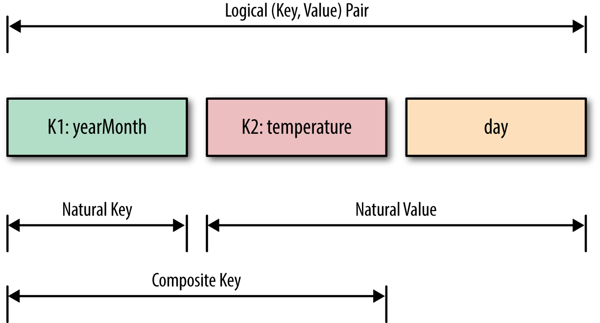

# Chapter 1. Secondary Sort: Introduction

A secondary sort problem relates to sorting values associated with a key in the reduce phase. Sometimes, it is called value-to-key conversion. The secondary sorting technique will enable us to sort the values (in ascending or descending order) passed to each reducer. I will provide concrete examples of how to achieve secondary sorting in ascending or descending order.

The goal of this chapter is to implement the Secondary Sort design pattern in MapReduce/Hadoop and Spark. In software design and programming, a design pattern is a reusable algorithm that is used to solve a commonly occurring problem. Typically, a design pattern is not presented in a specific programming language but instead can be implemented by many programming languages.

The MapReduce framework automatically sorts the keys generated by mappers. This means that, before starting reducers, all intermediate key-value pairs generated by mappers must be sorted by key (and not by value). Values passed to each reducer are not sorted at all; they can be in any order. What if you also want to sort a reducer’s values? MapReduce/Hadoop and Spark do not sort values for a reducer. So, for those applications (such as time series data) in which you want to sort your reducer data, the Secondary Sort design pattern enables you to do so.

First we’ll focus on the MapReduce/Hadoop solution. Let’s look at the MapReduce paradigm and then unpack the concept of the secondary sort:

```
 map(key1, value1) → list(key2, value2)
 reduce(key2, list(value2)) → list(key3, value3)
```

First, the map() function receives a key-value pair input, (key1, value1). Then it outputs any number of key-value pairs, (key2, value2). Next, the reduce() function receives as input another key-value pair, (key2, list(value2)), and outputs any number of (key3, value3) pairs.

Now consider the following key-value pair, (key2, list(value2)), as an input for a reducer:
```
list(value2) = (V1, V2, ..., Vn)
```

where there is no ordering between reducer values (V1, V2, ..., Vn).

The goal of the Secondary Sort pattern is to give some ordering to the values received by a reducer. So, once we apply the pattern to our MapReduce paradigm, then we will have:
```
SORT(V1, V2, ..., Vn) = (S1, S2, ..., Sn)
list(value2) = (S1, S2, ..., Sn)
```

where:
```
S1 < S2 < ... < Sn (ascending order), or
S1 > S2 > ... > Sn (descending order)
```

Here is an example of a secondary sorting problem: consider the temperature data from a scientific experiment. A dump of the temperature data might look something like the following (columns are year, month, day, and daily temperature, respectively):

```
2012, 01, 01, 5
2012, 01, 02, 45
2012, 01, 03, 35
2012, 01, 04, 10
...
2001, 11, 01, 46
2001, 11, 02, 47
2001, 11, 03, 48
2001, 11, 04, 40
...
2005, 08, 20, 50
2005, 08, 21, 52
2005, 08, 22, 38
2005, 08, 23, 70
```

Suppose we want to output the temperature for every year-month with the values sorted in ascending order. Essentially, we want the reducer values iterator to be sorted. Therefore, we want to generate something like this output (the first column is year-month and the second column is the sorted temperatures):
```
2012-01:  5, 10, 35, 45, ...
2001-11: 40, 46, 47, 48, ...
2005-08: 38, 50, 52, 70, ...
```

## Solutions to the Secondary Sort Problem

There are at least two possible approaches for sorting the reducer values. These solutions may be applied to both the MapReduce/Hadoop and Spark frameworks:

- The first approach involves having the reducer read and buffer all of the values for a given key (in an array data structure, for example), then doing an in-reducer sort on the values. This approach will not scale: since the reducer will be receiving all values for a given key, this approach might cause the reducer to run out of memory (java.lang.OutOfMemoryError). On the other hand, this approach can work well if the number of values is small enough that it will not cause an out-of-memory error.


- The second approach involves using the MapReduce framework for sorting the reducer values (this does not require in-reducer sorting of values passed to the reducer). This approach consists of “creating a composite key by adding a part of, or the entire value to, the natural key to achieve your sorting objectives.” For the details on this approach, see Java Code Geeks. This option is scalable and will not generate out-of-memory errors. Here, we basically offload the sorting to the MapReduce framework (sorting is a paramount feature of the MapReduce/Hadoop framework).

This is a summary of the second approach:

. Use the Value-to-Key Conversion design pattern: form a composite intermediate key, (K, V1), where V1 is the secondary key. Here, K is called a natural key. To inject a value (i.e., V1) into a reducer key, simply create a composite key (for details, see the DateTemperaturePair class). In our example, V1 is the temperature data.
. Let the MapReduce execution framework do the sorting (rather than sorting in memory, let the framework sort by using the cluster nodes).
. Preserve state across multiple key-value pairs to handle processing; you can achieve this by having proper mapper output partitioners (for example, we partition the mapper’s output by the natural key).


## Implementation Details

To implement the secondary sort feature, we need additional plug-in Java classes. We have to tell the MapReduce/Hadoop framework:

. How to sort reducer keys
. How to partition keys passed to reducers (custom partitioner)
. How to group data that has arrived at each reducer


## Sort order of intermediate keys

To accomplish secondary sorting, we need to take control of the sort order of intermediate keys and the control order in which reducers process keys. First, we inject a value (temperature data) into the composite key, and then we take control of the sort order of intermediate keys. The relationships between the natural key, composite key, and key-value pairs are depicted in Figure 1-1.

